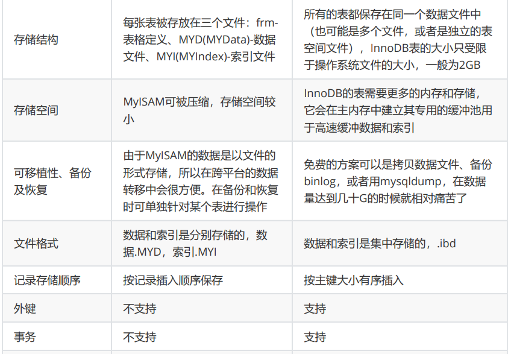
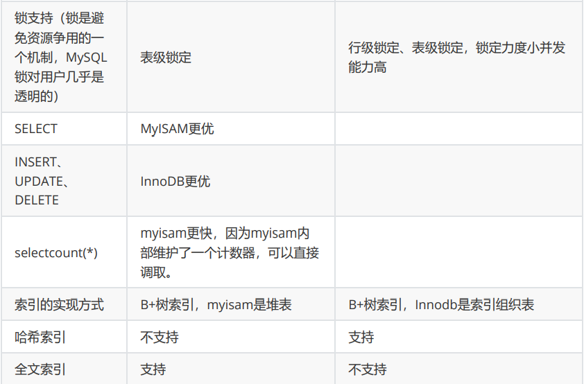
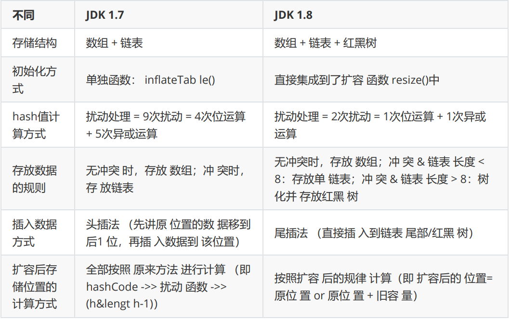
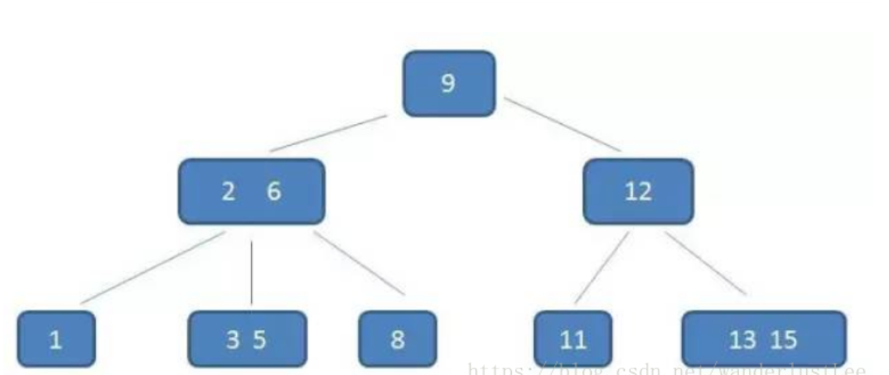
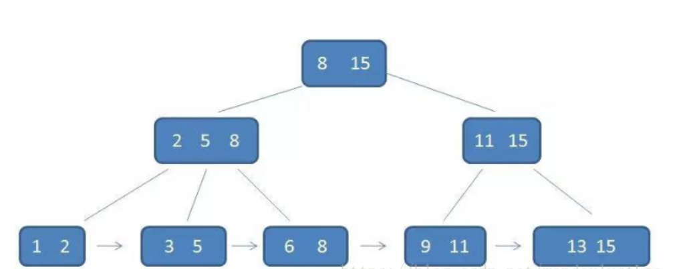

# 概念

## 栈和队列

​		栈与队列和数组、链表、树这几种数据结构不一样。栈与队列是一种逻辑结构。

### 栈		

栈是一种只能在一端进行插入和删除数据的数据结构，这一端被称为栈顶（top）。其特点简单来讲就是先进后出。栈的主要机制可以用数组来实现，当然也可以用链表来实现。

​		用数组实现栈，并完成常用操作——出栈、入栈、查看元素（只能查看栈顶元素）、判断栈是否为空等操作。

​		栈的所有操作复杂度都为O(1)，栈的操作不依赖栈中元素大小，栈不需要移动和比较操作。

### 队列

​		队列的特点是先进先出。队列也是用数组来实现。

​		用数组实现队列，并完成常用操作——出队、入队、查看元素、判断队列是否为空等操作。

​		队列的插入、删除等操作的复杂度都为O(1)。

## 循环和递归

- **递归的定义**
  **递归是在一个函数的内部调用这个函数自身**
- **循环的定义**
  **循环是通过计算的初始值及终止条件，在一个范围内重复运算**

### 循环

~~~java
    public static int Fibonacci(int num) {

        // 定义返回值，下一位，以及临时值
        int pre = 0, next = 1, sum = 0;

        for (int i = 0; i < num; i++) {
            sum = (pre + next);
            pre = next;
            next = sum;
        }

        return pre;

    }
~~~

### 递归

#### 递归的缺点

时间和空间消耗
递归由于是函数调用自身，而函数调用时是有时间和空间的消耗的：每一次函数调用，都需要在内存栈中分配空间以保存参数、返回地址及临时变量，而且往栈里压入数据和弹出数据都需要时间。这就不难理解有些时候递归实现的效率不如循环。

重复的计算
递归有可能很多计算都是重复的，从而对性能带来很大的负面影响。递归实际上是把一个大问题拆成很多小问题，如果那些小问题存在相互重叠的部分，就存在重复的计算。
如斐波那契数列，教科书上讲解递归函数的时候经常会讲到这个例子，但是递归的解法并不是最适合这道题目的。上述递归的解法有很严重的效率问题。
我们很容易就可以用递归解法来求斐波那契数列，代码如下：

~~~java
    /**
     * 斐波那切数列
     * @param num 第几个数列
     * @return 数列值
     */
    public static long Fibonacci(long num) {

        if (num <= 0) return 0;
        if (num == 1) return 1;

        return Fibonacci(num - 1) + Fibonacci(num - 2);
    }
~~~

##### 调用栈溢出

除效率之外，递归还有可能引起**调用栈溢出**。前面提到了需要为每一次函数调用在内存栈中分配空间，而每个进程的栈的容量是有限的。当递归调用的层级太多时，就会超出栈的容量，从而导致调用栈溢出。

# 算法

## 哈希表

### 两数之和

~~~java
class Solution {

    /**
     * 两数之和
     *
     * @param nums
     * @param target
     * @return
     */
    public int[] twoSum(int[] nums, int target) {

        // 建立哈希表:key-值，value-索引
        HashMap<Integer, Integer> map = new HashMap<>();

        // 遍历数组
        for (int i = 0; i < nums.length; i++) {

            // 如果存在符合这个条件的直接返回
            if (map.containsKey(target - nums[i])) {
                return new int[]{map.get(target - nums[i]), i};
            }
            map.put(nums[i], i);
        }

        return new int[0];
    }
}

~~~

## 链表

### 反转链表

~~~java
class Solution {
    public ListNode reverseList(ListNode head) {

        //递归终止条件是当前为空，或者下一个节点为空
        if (head == null || head.next == null) {
            return head;
        }

        //这里的cur就是最后一个节点-递归反转
        ListNode cur = reverseList(head.next);
        // 反转链表
        head.next.next = head;
        // 将链表的后面置空
        head.next = null;
        
        return cur;
    }

}

~~~

### 合并两个有序链表

~~~java
class Solution {

    /**
     * 合并有序链表
     *
     * @param l1 链表1
     * @param l2 链表2
     * @return 合并之后
     */
    public ListNode mergeTwoLists(ListNode l1, ListNode l2) {
        if (l1 == null) return l2;
        if (l2 == null) return l1;

        // 比较链表的大小
        if (l1.val  > l2.val ) {
            l2.next = mergeTwoLists(l1, l2.next);
            return l2;
        } else {
            l1.next = mergeTwoLists(l1.next, l2);
            return l1;
        }
    }
}

~~~

###  链表中间节点

下面的是删除中间节点，但是查找的话知识讲中介节点记录一下，最重要的快慢指针。

~~~java
class Solution {
    public ListNode deleteMiddle(ListNode head) {
        // 为空或者只有一个头结点
        if (head.next == null || head == null) {
            return null;
        }

        // 使用快慢指针查询中间节点
        // 使用pre代表慢指针的前面
        ListNode fast = head, slow = head, pre = null;
        while (fast != null && fast.next != null) {
            fast = fast.next.next;
            pre = slow;
            slow = slow.next;
        }

        // pre指向slow的后一个，使slow断裂
        pre.next = pre.next.next;
        return head;
    }
}
~~~

### 链表相加

~~~java
class Solution {
    public ListNode addTwoNumbers(ListNode l1, ListNode l2) {
        // 创建新的节点
        ListNode listNode = new ListNode(0);
        ListNode temp = listNode;

        // 定义一个进位数
        int carry = 0;

        // 遍历循环相加
        while (l1 != null || l2 != null) {

            int x = l1 == null ? 0 : l1.val;
            int y = l2 == null ? 0 : l2.val;

            int sum = x + y + carry;
            carry = sum / 10;

            // 判断是否有进位数
            temp.next = new ListNode(sum % 10);

            // 后移
            temp = temp.next;
            if (l1 != null) l1 = l1.next;
            if (l2 != null) l2 = l2.next;
        }

        // 判断进位数
        if (carry == 1) temp.next = new ListNode(1);

        return listNode.next;
    }
}

~~~

## 顺时针打印矩阵

~~~~java
class Solution {

    /**
     * 顺时针打印矩阵
     *
     * @param matrix 矩阵
     * @return 矩阵
     */
    public int[] spiralOrder(int[][] matrix) {

        // 判断
        if (matrix == null || matrix.length == 0 || matrix[0].length == 0) return new int[0];

        // 顺时针读取数组
        int left = 0, right = matrix[0].length - 1, up = 0, dowm = matrix.length - 1;
        int index = 0;// 新数组的自增量
        // 定义新的数组
        int[] res = new int[(right + 1) * (dowm + 1)];

        while (true) {

            // 从左到右
            for (int i = left; i <= right; i++) {
                res[index++] = matrix[up][i];
            }
            if (++up > dowm) break;

            // 从上到下
            for (int i = up; i <= dowm; i++) {
                res[index++] = matrix[i][right];
            }
            if (left > --right) break;

            // 从右到左
            for (int i = right; i >= left; i--) {
                res[index++] = matrix[dowm][i];
            }
            if (up > --dowm) break;

            // 从下到上
            for (int i = dowm; i >= up; i--) {
                res[index++] = matrix[i][left];
            }
            if (++left > right) break;
        }

        return res;
    }
}

~~~~

## 字符串

### 移掉 K 位数字

~~~java
class Solution {

    /**
     * 移掉 K 位数字
     *
     * @param num 字符串
     * @param k   删除几位数字
     * @return 最小值
     */
    public String removeKdigits(String num, int k) {
        // 判断
        if (num.length() <= k) return "0";

        // 查找最小值
        StringBuilder sb = new StringBuilder();
        // 遍历数字字符串
        for (char c : num.toCharArray()) {

            // 要添加的数小于于前面的数，删除前面的数
            while (k > 0 && sb.length() > 0 && c < sb.charAt(sb.length() - 1)) {
                sb.deleteCharAt(sb.length() - 1);
                k--;
            }
            // 添加第一位数-和添加抛弃之后的数
            if (c != '0' || sb.length() > 0) {
                sb.append(c);
            }
        }

        // 没有移除完K位数字
        while (k > 0 && sb.length() > 0) {
            sb.deleteCharAt(sb.length() - 1);
            k--;
        }

        // 字符串是否满足添加
        return sb.length() == 0 ? "0" : sb.toString();
    }
}

~~~

### 无重复字符的最长子串

~~~java
class Solution {
    /**
     * 无重复字符的最长子串
     *
     * @param s 原字符串
     * @return 无重复最长长度
     */
    public int lengthOfLongestSubstring(String s) {
        
        // 使用滑动窗口来解决
        HashMap<Character, Integer> map = new HashMap<>();

        int maxLength = 0;
        // start和end来控制左右指针的滑动
        for (int start = 0, end = 0; end < s.length(); end++) {
            char charAt = s.charAt(end);
            // 判断是否存在
            if (map.containsKey(charAt)) {
                start = Math.max(start, map.get(charAt) + 1);
            }
            maxLength = Math.max(maxLength, end - start + 1);

            map.put(charAt, end);
        }

        return maxLength;
    }
}
~~~

### 最小覆盖子串

~~~java
class Solution {

    /**
     * 最小覆盖子串
     *
     * @param s 长字符串
     * @param t 短字符串
     * @return 包含字符串
     */
    public String minWindow(String s, String t) {
        //维护s串中滑动窗口中各个字符出现次数
        Map<Character, Integer> hs = new HashMap<>();
        //维护t串中各个字符出现次数
        Map<Character, Integer> ht = new HashMap<>();
        for (int i = 0; i < t.length(); i++) {
            ht.put(t.charAt(i), ht.getOrDefault(t.charAt(i), 0) + 1);
        }
        
        String ans = "";
        //cnt维护s串[left,right]中满足t串的元素的个数，记录相对应字符的总数
        int len = Integer.MAX_VALUE, cnt = 0;
        //区间[left,right]表示当前滑动窗口
        for (int left = 0, right = 0; right < s.length(); right++) {
            hs.put(s.charAt(right), hs.getOrDefault(s.charAt(right), 0) + 1);
            //如果ht表中也包含当前字符
            if (ht.containsKey(s.charAt(right))) {
                //并且hs表中的字符个数<=ht表中的字符个数,说明该字符是必须的，并且还未到达字符串t所要求的数量
                if (hs.get(s.charAt(right)) <= ht.get(s.charAt(right))) {
                    cnt++;
                }
            }
            //收缩滑动窗口
            //如果左边界的值不在ht表中 或者 它在hs表中的出现次数多于ht表中的出现次数
            while (left < right && (!ht.containsKey(s.charAt(left)) || hs.get(s.charAt(left)) > ht.get(s.charAt(left)))) {
                hs.put(s.charAt(left), hs.get(s.charAt(left)) - 1);
                left++;
            }
            //此时滑动窗口包含符串 t 的全部字符
            if (cnt == t.length() && right - left + 1 < len) {
                len = right - left + 1;
                ans = s.substring(left, right + 1);
            }
        }
        return ans;
    }
}

~~~

# 数据库

## SQL语句执行过程

1. from (这里也包括from中的子语句)
2. join on 
3. where
4. group by(开始使用select中的别名，后面的语句中都可以使用；但是不能使用ROW_NUMBER()等窗口函数的别名)
5. avg,sum.... 等聚合函数
6. having
7. select
8. distinct
9. order by
10. limiit

所有的 查询语句都是从from开始执行的，在执行过程中，每个步骤都会为下一个步骤生成一个虚拟表，这个虚拟表将作为下一个执行步骤的输入。

1. from

form是一次查询语句的开端。

如果是一张表，会直接操作这张表；如果这个from后面是一个子查询，会先执行子查询中的内容，子查询的结果也就是第一个虚拟表T1。（注意：子查询中的执行流程也是按照本篇文章讲的顺序哦）。如果需要关联表，使用join，请看2，3

2. join

如果from后面是多张表，join关联，会首先对前两个表执行一个笛卡尔乘积，这时候就会生成第一个虚拟表T1（注意：这里会选择相对小的表作为基础表）；

3. on

对虚表T1进行ON筛选，只有那些符合的行才会被记录在虚表T2中。（注意，这里的这里如果还有第三个表与之关联，会用T2与第三个表进行笛卡尔乘积生产T3表，继续重复3. on步骤生成T4表，不过下面的顺序讲解暂时不针对这里的T3和T4，只是从一个表关联查询T2继续说）

4. where

对虚拟表T2进行WHERE条件过滤。只有符合的记录才会被插入到虚拟表T3中。

5.group by

group by 子句将中的唯一的值组合成为一组，得到虚拟表T4。如果应用了group by，那么后面的所有步骤都只能操作T4的列或者是执行6.聚合函数（count、sum、avg等）。（注意：原因在于分组后最终的结果集中只包含每个组中的一行。谨记，不然这里会出现很多问题，下面的代码误区会特别说。）

6. avg,sum.... 等聚合函数

聚合函数只是对分组的结果进行一些处理，拿到某些想要的聚合值，例如求和，统计数量等，并不生成虚拟表。

7. having

应用having筛选器，生成T5。HAVING子句主要和GROUP BY子句配合使用，having筛选器是第一个也是为唯一一个应用到已分组数据的筛选器。

8. select

执行select操作，选择指定的列，插入到虚拟表T6中。

9. distinct

对T6中的记录进行去重。移除相同的行，产生虚拟表T7.（注意：事实上如果应用了group by子句那么distinct是多余的，原因同样在于，分组的时候是将列中唯一的值分成一组，同时只为每一组返回一行记录，那么所以的记录都将是不相同的。）

10. order by

应用order by子句。按照order_by_condition排序T7，此时返回的一个游标，而不是虚拟表。sql是基于集合的理论的，集合不会预先对他的行排序，它只是成员的逻辑集合，成员的顺序是无关紧要的。对表进行排序的查询可以返回一个对象，这个对象包含特定的物理顺序的逻辑组织。这个对象就叫游标。

order by的几点说明

因为order by返回值是游标，那么使用order by 子句查询不能应用于表表达式。order by排序是很需要成本的，除非你必须要排序，否则最好不要指定order by，order by的两个参数  asc（升序排列）  desc（降序排列）

11. limit

取出指定行的记录，产生虚拟表T9, 并将结果返回。

limit后面的参数可以是 一个limit m ，也可以是limit m n，表示从第m条到第n条数据。

（注意：很多开发人员喜欢使用该语句来解决分页问题。对于小数据，使用LIMIT子句没有任何问题，当数据量非常大的时候，使用LIMIT m,n是非常低效的。因为LIMIT的机制是每次都是从头开始扫描，如果需要从第60万行开始，读取3条数据，就需要先扫描定位到60万行，然后再进行读取，而扫描的过程是一个非常低效的过程。所以，对于大数据处理时，是非常有必要在应用层建立一定的缓存机制）

## 事务

事务是一个单独的隔离操作：事务中的所有命令都会序列化、按顺序地执行。事务在执行的过程中，不会被其他客户端发送来的命令请求所打断。 事务是一个原子操作：事务中的命令要么全部被执行，要么全部都不执行。

## 数据库三大范式是什么

第一范式：每个列都不可以再拆分。 

第二范式：在第一范式的基础上，非主键列完全依赖于主键，而不能是依赖于主键的一部分。 

第三范式：在第二范式的基础上，非主键列只依赖于主键，不依赖于其他非主键。 

在设计数据库结构的时候，要尽量遵守三范式，如果不遵守，必须有足够的理由。比如性能。事实上我 们经常会为了性能而妥协数据库的设计。

## mysql的索引使用

1. 字段的数值有唯一性的限制

2. 频繁作为 WHERE 查询条件的字段

3. 经常 GROUP BY 和 ORDER BY 的列

4. UPDATE、DELETE 的 WHERE 条件列
5. DISTINCT 字段需要创建索引

6. 多表 JOIN 连接操作时，创建索引注意事项
   1. 其次， `对 WHERE 条件创建索引`
   2. 最后， `对用于连接的字段创建索引` 
7. 使用列的类型小的创建索引

8. 使用字符串前缀创建索引
9. 区分度高(散列性高)的列适合作为索引
10. 使用最频繁的列放到联合索引的左侧
11. 在多个字段都要创建索引的情况下，联合索引优于单值索引

- 注意
- 限制索引的数目
- 在where中使用不到的字段，不要设置索引
- 数据量小的表最好不要使用索引
- 有大量重复数据的列上不要建立索引
- 避免对经常更新的表创建过多的索引
- 不建议用无序的值作为索引
- 删除不再使用或者很少使用的索引
- 不要定义夯余或重复的索引

## 数据分页

​		LIMIT 子句可以被用于强制 SELECT 语句返回指定的记录数。LIMIT 接受一个或两个数字参数。参数必须 是一个整数常量。如果给定两个参数，第一个参数指定第一个返回记录行的偏移量，第二个参数指定返 回记录行的 大数目。初始记录行的偏移量是 0(而不是 1)

优化思路一 在索引上完成排序分页操作，最后根据主键关联回原表查询所需要 的其他列内容。

~~~sql
EXPLAIN SELECT * FROM student t,(SELECT id FROM student ORDER BY id LIMIT 2000000,10) a WHERE t.id = a.id;
~~~

优化思路二 该方案适用于主键自增的表，可以把Limit 查询转换成某个位置的查 询 。

~~~java
EXPLAIN SELECT * FROM student WHERE id > 2000000 LIMIT 10;
~~~

## mysql的引擎

常用的存储引擎有以下：

 **Innodb引擎**：Innodb引擎提供了对数据库ACID事务的支持。并且还提供了行级锁和外键的约束。它的 设计的目标就是处理大数据容量的数据库系统。 

**MyIASM引擎(原本Mysql的默认引擎)**：不提供事务的支持，也不支持行级锁和外键。 

**MEMORY引擎**：所有的数据都在内存中，数据的处理速度快，但是安全性不高。

- InnoDB索引是聚簇索引，MyISAM索引是非聚簇索引。 
- InnoDB的主键索引的叶子节点存储着行数据，因此主键索引非常高效。 
- MyISAM索引的叶子节点存储的是行数据地址，需要再寻址一次才能得到数据。 
- InnoDB非主键索引的叶子节点存储的是主键和其他带索引的列数据，因此查询时做到覆盖索引会 非常高效。
- 如果没有特别的需求，使用默认的Innodb即可。 MyISAM：以读写插入为主的应用程序，比如博客系统、新闻门户网站。 Innodb：更新（删除）操作频率也高，或者要保证数据的完整性；并发量高， 支持事务和外键。比如OA自动化办公系统。

## 锁

MyISAM和InnoDB存储引擎使用的锁： 

- MyISAM采用表级锁(table-level locking)。 
- InnoDB支持行级锁(row-level locking)和表级锁，默认为行级锁

### 行级锁，表级锁和页级锁对比

行级锁 行级锁是Mysql中锁定粒度最细的一种锁，表示只针对当前操作的行进行加锁。行级锁能大大减 少数据库操作的冲突。其加锁粒度最小，但加锁的开销也最大。行级锁分为共享锁 和 排他锁。

特点：开销大，加锁慢；会出现死锁；锁定粒度最小，发生锁冲突的概率最低，并发度也最高。

表级锁 表级锁是MySQL中锁定粒度最大的一种锁，表示对当前操作的整张表加锁，它实现简单，资源消 耗较少，被大部分MySQL引擎支持。最常使用的MYISAM与INNODB都支持表级锁定。表级锁定分为表 共享读锁（共享锁）与表独占写锁（排他锁）。

特点：开销小，加锁快；不会出现死锁；锁定粒度大，发出锁冲突的概率最高，并发度最低。

页级锁 页级锁是MySQL中锁定粒度介于行级锁和表级锁中间的一种锁。表级锁速度快，但冲突多，行级 冲突少，但速度慢。所以取了折衷的页级，一次锁定相邻的一组记录。

特点：开销和加锁时间界于表锁和行锁之间；会出现死锁；锁定粒度界于表锁和行锁之间，并发度一般

### 从锁的类别上分MySQL都有哪些锁呢？

从锁的类别上来讲，有共享锁和排他锁
共享锁: 又叫做读锁。 当用户要进行数据的读取时，对数据加上共享锁。共享锁可以同时加上多个。

排他锁: 又叫做写锁。 当用户要进行数据的写入时，对数据加上排他锁。排他锁只可以加一个，他和其 他的排他锁，共享锁都相斥。

### 什么是死锁？怎么解决？

死锁是指两个或多个事务在同一资源上相互占用，并请求锁定对方的资源，从而导致恶性循环的现象。 常见的解决死锁的方法

1、如果不同程序会并发存取多个表，尽量约定以相同的顺序访问表，可以大大降低死锁机会。 

2、在同一个事务中，尽可能做到一次锁定所需要的所有资源，减少死锁产生概率； 

3、对于非常容易产生死锁的业务部分，可以尝试使用升级锁定颗粒度，通过表级锁定来减少死锁产生的 概率； 

如果业务处理不好可以用分布式事务锁或者使用乐观锁

### 数据库的乐观锁和悲观锁是什么？怎么实现的？

数据库管理系统（DBMS）中的并发控制的任务是确保在多个事务同时存取数据库中同一数据时不破坏 事务的隔离性和统一性以及数据库的统一性。乐观并发控制（乐观锁）和悲观并发控制（悲观锁）是并 发控制主要采用的技术手段。

悲观锁：假定会发生并发冲突，屏蔽一切可能违反数据完整性的操作。在查询完数据的时候就把事务锁 起来，直到提交事务。实现方式：使用数据库中的锁机制乐观锁：假设不会发生并发冲突，只在提交操 作时检查是否违反数据完整性。在修改数据的时候把事务锁起来，通过version的方式来进行锁定。实现 方式：乐一般会使用版本号机制或CAS算法实现。

两种锁的使用场景从上面对两种锁的介绍，我们知道两种锁各有优缺点，不可认为一种好于另一种，像 乐观锁适用于写比较少的情况下（多读场景），即冲突真的很少发生的时候，这样可以省去了锁的开 销，加大了系统的整个吞吐量。

但如果是多写的情况，一般会经常产生冲突，这就会导致上层应用会不断的进行retry，这样反倒是降低了性能，所以一般多写的场景下用悲观锁就比较合适。

# 基础

## 集合

Collection集合主要有List和Set两大接口

### list

List：一个有序（元素存入集合的顺序和取出的顺序一致）容器，元素可以重 复，可以插入多个 null元素，元素都有索引。常用的实现类有 ArrayList、LinkedList 和 Vector。 

ArrayList的优点如下： 

ArrayList 底层以数组实现，是一种随机访问模式。ArrayList 实现了 RandomAccess 接口，因此查 找的时候非常快。 ArrayList 在顺序添加一个元素的时候非常方便。 

ArrayList 的缺点如下： 删除元素的时候，需要做一次元素复制操作。如果要复制的元素很多，那么就会比较耗费性能。  插入元素的时候，也需要做一次元素复制操作，缺点同上。 ArrayList 比较适合顺序添加、随机访问的场景。

数据结构实现：ArrayList 是动态数组的数据结构实现，而 LinkedList 是双向链表的数据结构实 现。 随机访问效率：ArrayList 比 LinkedList 在随机访问的时候效率要高，因为 LinkedList 是线性的数 据存储方式，所以需要移动指针从前往后依次查找。 增加和删除效率：在非首尾的增加和删除操作，LinkedList 要比 ArrayList 效率要高，因为 ArrayList 增删操作要影响数组内的其他数据的下标。 内存空间占用：LinkedList 比 ArrayList 更占内存，因为 LinkedList 的节点除了存储数据，还存储 了两个引用，一个指向前一个元素，一个指向后一个元素。 线程安全：ArrayList 和 LinkedList 都是不同步的，也就是不保证线程安全； 综合来说，在需要频繁读取集合中的元素时，更推荐使用 ArrayList，而在插入和删除操作较多时，更推 荐使用 LinkedList。

Set：一个无序（存入和取出顺序有可能不一致）容器，不可以存储重复元素， 只允许存入一个 null元素，必须保证元素唯一性。Set 接口常用实现类是 HashSet、 LinkedHashSet 以及 TreeSet。

### map

Map是一个键值对集合，存储键、值和之间的映射。 Key无序，唯一；value 不 要求有序，允许重复。 Map没有继承于Collection接口，从Map集合中检索元 素时，只要给出键对象，就会返回对应的值对 象。 Map 的常用实现类：HashMap、TreeMap、HashTable、LinkedHashMap、 ConcurrentHashMap

HashMap概述： HashMap是基于哈希表的Map接口的非同步实现。此实现提供所有可选的映射操作， 并允许使用null值和null键。此类不保证映射的顺序，特别是它不保证该顺序恒久不变。

HashMap的数据结构： 在Java编程语言中， 基本的结构就是两种，一个是数组，另外一个是模拟指针 （引用），所有的数据结构都可以用这两个基本结构来构造的，HashMap也不例外。HashMap实际上 是一个“链表散列”的数据结构，即数组和链表的结合体。

HashMap 基于 Hash 算法实现的

1. 当我们往Hashmap中put元素时，利用key的hashCode重新hash计算出当前对象的元素在数组中 的下标
2.  存储时，如果出现hash值相同的key，此时有两种情况。(1)如果key相 同，则覆盖原始值；(2)如果key不同（出现冲突），则将当前的key-value 放入链表中 
3. 获取时，直接找到hash值对应的下标，在进一步判断key是否相同，从而找到对应值。 
4. 理解了以上过程就不难明白HashMap是如何解决hash冲突的问题，核心就是使用了数组的存储方 式，然后将冲突的key的对象放入链表中，一旦发现冲突就在链表中做进一步的对比。 
5. 需要注意Jdk 1.8中对HashMap的实现做了优化，当链表中的节点数据超过八个 之后，该链表会转为红黑树来提高查询效率，从原来的O(n)到O(logn

在Java中，保存数据有两种比较简单的数据结构：数组和链表。数组的特点是：寻址容易，插入和删除 困难；链表的特点是：寻址困难，但插入和删除容易；所以我们将数组和链表结合在一起，发挥两者各 自的优势，使用一种叫做拉链法的方式可以解决哈希冲突。

1. resize 扩容优化 
2. 引入了红黑树，目的是避免单条链表过长而影响查询效率，红黑树算法请参考 
3. 解决了多线程死循环问题，但仍是非线程安全的，多线程时可能会造成数据丢失问题。

# 数据结构

## 二叉树，AV树，红黑树，B+树的区别

**二叉查找树：**

[二叉查找树](https://so.csdn.net/so/search?q=二叉查找树&spm=1001.2101.3001.7020)就是左结点小于根节点，右结点大于根节点的一种排序树，也叫二叉搜索树。也叫BST，英文Binary Sort Tree。

二叉查找树比普通树**查找更快**，查找、插入、删除的[时间复杂度](https://so.csdn.net/so/search?q=时间复杂度&spm=1001.2101.3001.7020)为O（logN）。但是二叉查找树有一种极端的情况，就是会变成一种线性链表似的结构。此时时间复杂度就变味了O（N），为了解决这种情况，出现了二叉平衡树。

**平衡二叉树：**

平衡二叉树全称平衡[二叉搜索树](https://so.csdn.net/so/search?q=二叉搜索树&spm=1001.2101.3001.7020)，也叫AVL树。是一种自平衡的树。

[AVL树](https://so.csdn.net/so/search?q=AVL树&spm=1001.2101.3001.7020)也规定了左结点小于根节点，右结点大于根节点。并且还规定了左子树和右子树的高度差不得超过1。这样保证了它不会成为线性的链表。AVL树的**查找稳定**，查找、插入、删除的时间复杂度都为O（logN），但是由于要维持自身的平衡，所以进行插入和删除结点操作的时候，需要对结点进行**频繁的旋转。**

AVL树每一个节点只能存放一个元素，并且每个节点只有两个子节点。当进行查找时，就**需要多次磁盘IO**，（数据是存放在磁盘中的，每次查询是将磁盘中的一页数据加入内存，树的每一层节点存放在一页中，不同层数据存放在不同页。）这样如果需要多层查询就需要多次磁盘IO。为了解决AVL树的这个问题，就出现了B树。

**B树：**

B树也叫平衡树，也叫作B-树，英文为Blance-Tree。是一种多路平衡树。

一个m阶的B树规定了：

1.根结点至少有两个子女。

2.每个中间节点都包含k-1个元素和k个孩子，其中 m/2 <= k <= m 。

3.每一个叶子节点都包含k-1个元素，其中 m/2 <= k <= m。

4.所有的叶子结点都位于同一层。

5.每个节点中的元素从小到大排列，节点当中k-1个元素正好是k个孩子包含的元素的值域分划。

B树每一层存放了更多的节点，由AVL树的“瘦高”变成了“矮胖”。可以**相对减少磁盘IO的次数**。MongoDB的索引就是用B树实现的。

B树也是一种**自平衡**的树，在进行插入和删除操作时也需要对结点进行旋转等操作。

不过，B树的**查找不稳定**，最好的情况就是在根节点查到了，最坏的情况就是在叶子结点查到。另外，B树在**遍历方面比较麻烦**，由于需要进行中序遍历，所以也会进行一定数量的磁盘IO。为了解决这些问题，出现了B+树。

**B+树：**

B+树每个非叶子结点存放的元素只用于索引作用，所有数据保存在叶子结点。

一个m阶的B+树规定了：

1.有k个子树的中间节点包含有k个元素（B树中是k-1个元素），每个元素不保存数据，只用来索引，所有数据都保存在叶子节点。

2.所有的叶子结点中包含了全部元素的信息，及指向含这些元素记录的指针，且叶子结点本身依关键字的大小自小而大顺序链接。

3.所有的中间节点元素都同时存在于子节点，在子节点元素中是最大（或最小）元素。

因为非叶子结点中存放的元素不存放数据，所以每一层可以容纳更多元素，也就是磁盘中的每一页可以存放更多元素。这样在查找时，**磁盘IO的次数也会减少**。

另外，**B+树的查找稳定**，因为所有的数据都在叶子结点。每个叶子结点也通过指针指向构成了一种[链表](https://so.csdn.net/so/search?q=链表&spm=1001.2101.3001.7020)结构，所以**遍历数据也会简单很多。**

B+树的插入和删除和B树类似。

**红黑树：**

红黑树也叫RB树，RB-Tree。是一种自平衡的二叉查找树，它的节点的颜色为红色和黑色。它不严格控制左、右子树高度或节点数之差小于等于1。也是一种解决二叉查找树极端情况的数据结构。

红黑树规定了：

1.节点是红色或黑色。

2.根节点是黑色。

3.每个叶子节点都是黑色的空节点（NIL节点）。

4 每个红色节点的两个子节点都是黑色。也就是说从每个叶子到根的所有路径上不能有两个连续的红色节点)。

5.从任一节点到其每个叶子的所有路径都包含相同数目的黑色节点。

红黑树在查找方面和AVL树操作几乎相同。但是在插入和删除操作上，AVL树每次插入删除会进行大量的平衡度计算，红黑树是牺牲了严格的高度平衡的优越条件为代价，它只要求部分地达到平衡要求，结合变色，降低了对旋转的要求，从而提高了性能。红黑树能够以O(log2 n)的时间复杂度进行搜索、插入、删除操作。此外，由于它的设计，任何不平衡都会在**三次旋转**之内解决。

相比于BST，因为红黑树可以能确保**树的最长路径不大于两倍的最短路径的长度**，所以可以看出它的查找效果是有最低保证的。在最坏的情况下也可以保证O(logN)的，这是要好于二叉查找树的。因为二叉查找树最坏情况可以让查找达到O(N)。

**红黑树的算法时间复杂度和AVL相同**，但**统计性能比AVL树更高**，所以在插入和删除中所做的后期维护操作肯定会比红黑树要耗时好多，但是他们的查找效率都是O(logN)，所以红黑树应用还是高于AVL树的. 实际上插入 AVL 树和红黑树的速度取决于你所插入的数据.如果你的数据分布较好,则比较宜于采用 AVL树(例如随机产生系列数),但是如果你想处理比较杂乱的情况,则红黑树是比较快的。

红黑树广泛用于TreeMap、TreeSet，以及jdk1.8后的HashMap。

# 中间件

## Redis

### Redis事务的概念

Redis 事务的本质是通过MULTI、EXEC、WATCH等一组命令的集合。事务支 持一次执行多个命令，一个事务中所有命令都会被序列化。在事务执行过程，会按照顺序串行化执行队列中的命令，其他客户端提交的命令请求不会插入到事务执行命令序列 中。 总结说：redis事务就是一次性、顺序性、排他性的执行一个队列中的一系列命令。

### Redis特点

基本数据类型：string set zset list hash

Redis是单线程执行的（键值对读写），没有线程切换开销（多线程：切换上下文），全局哈希表（数组+链表【HashMap会树化，数组+红黑树】）

redis设置过期时间之后，如果再次修改值得话没有加过期时间的话，那么过期时间就会被擦除，永不过期。

### redis数据和mysql保持一致性

先删除缓存
1、如果先删除Redis缓存数据，然而还没有来得及写入MySQL，另一个线程就来读取

2、这个时候发现缓存为空，则去Mysql数据库中读取旧数据写入缓存，此时缓存中为脏数据。

3、然后数据库更新后发现Redis和Mysql出现了数据不一致的问题

后删除缓存
1、如果先写了库，然后再删除缓存，不幸的写库的线程挂了，导致了缓存没有删除

2、这个时候就会直接读取旧缓存，最终也导致了数据不一致情况

3、因为写和读是并发的，没法保证顺序,就会出现缓存和数据库的数据不一致的问题

#### 延时双删策略

在写库前后都进行redis.del(key)操作，并且设定合理的超时时间。

##### 具体步骤

1、先删除缓存
2、再写数据库
3、休眠xxx毫秒（根据具体的业务时间来定）
4、再次删除缓存

为什么要删除两次：因为第一次删除的是还没更新前的数据，第二次删除则是因为读取的并发性导致的缓存重新写入数据出现的垃圾数据。

问题：这个500毫秒怎么确定的，具体该休眠多久时间呢？

1、需要评估自己的项目的读数据业务逻辑的耗时。

2、这么做的目的，就是确保读请求结束，写请求可以删除读请求造成的缓存脏数据。

3、当然这种策略还要考虑redis和数据库主从同步的耗时。

4、最后的的写数据的休眠时间：则在读数据业务逻辑的耗时基础上，加几百ms即可。

如果你们的删缓存失败了，怎么办？那不是还是会出现缓存和数据库不一致的情况么？比如一个写数据请求，然后写入数据库了，删缓存失败了，这会就出现不一致的情况了。

~~~~
这时候我们就需要一个中间件的无私配合了，那就是使用消息来进行重试机制。
步骤：
1、业务代码去更新数据库
2、数据库的操作进行记录日志。
3、订阅程序提取出所需要的数据以及key
4、获得该信息尝试删除缓存，发现删除失败的时候，发送消息到消息队列
5、继续重试删除缓存的操作，直到删除缓存成功。
~~~~

#### 异步更新缓存（基于Mysql binlog的同步机制）

##### 整体思路

1. 涉及到更新的数据操作，利用Mysql binlog 进行增量订阅消费

2. 将消息发送到消息队列

3. 通过消息队列消费将增量数据更新到Redis上

4. 操作情况

   - 读取Redis缓存：热数据都在Redis上

   - 写Mysql：增删改都是在Mysql进行操作

   - 更新Redis数据：Mysql的数据操作都记录到binlog，通过消息队列及时更新到Redis上

##### Redis更新过程

数据操作主要分为两种：

1、一种是全量（将所有数据一次性写入Redis）
2、一种是增量（实时更新）

~~~
读取binlog后分析 ，利用消息队列,推送更新各台的redis缓存数据。
1、这样一旦MySQL中产生了新的写入、更新、删除等操作，就可以把binlog相关的消息推送至Redis
2、Redis再根据binlog中的记录，对Redis进行更新
3、其实这种机制，很类似MySQL的主从备份机制，因为MySQL的主备也是通过binlog来实现的数据一致性
~~~

这里的消息推送工具你也可以采用别的第三方：kafka、rabbitMQ等来实现推送更新Redis!
